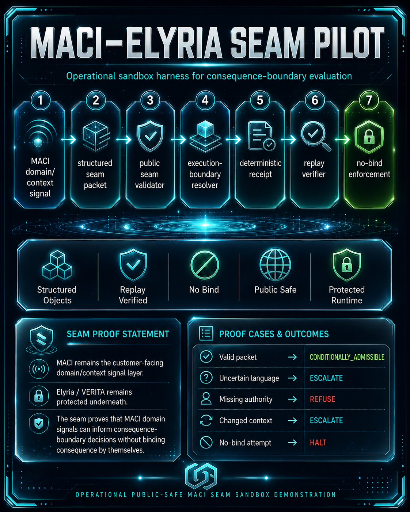

# MACI public-safe seam pilot on Elyria/VERITA

<!-- MACI_HERO_START -->

<p align="center">
  
</p>

<p align="center">
  
  
  
</p>

<p align="center">
  
  
  
  
  
  
</p>

<p align="center">
  <strong>Customer context enters → boundary adapter evaluates → decision returns → receipt issues → replay checks → no-bind holds unless admitted.</strong>
</p>

---

## ✦ Public Positioning

**MACI public-safe seam pilot on Elyria/VERITA** is a public-safe executable review build showing the customer-facing seam, API, UI, schemas, workflow gate, receipt layer, replay verifier, proof transcript, review bundle, and protected boundary adapter.

The private Elyria/VERITA logic stays outside this repository.

```text
Public repo: public-safe executable seam shell, contracts, UI, public-safe adapter, receipts, replay, tests, docs, release bundle.
Private repo/module: protected Elyria/VERITA production logic, private admissibility geometry, production policy internals.
```

## ✦ What This Demonstrates

| Layer | Public-safe function | Review signal |
|---|---|---|
| 🛰️ **MACI** | Customer/domain context signal layer | Structures movement packet |
| 🔎 **Assumption Precheck** | Surfaces embedded assumptions before final proof | `CLEAR / REVIEW / BLOCK` |
| 🛡️ **Boundary Adapter** | Routes to public-safe fallback or external private engine | Private logic not committed |
| 🔒 **No-Bind Guard** | Prevents premature consequence formation | `REFUSE / HOLD / ESCALATE / HALT → NO_BIND` |
| 🧾 **Receipt Layer** | Captures deterministic result proof | packet hash, result hash, witness digest |
| 🔁 **Replay Verifier** | Checks same, changed, and tampered states | replay status + hash validation |
| 📦 **Review Bundle** | Packages reviewer evidence | manifest + SHA256 sums + proof transcripts |

## ✦ What This Does Not Expose

```text
private Elyria kernel
private admissibility geometry
production policy internals
customer-specific rules
deployment secrets
commercial runtime logic
```

## ✦ Review in 5 Minutes

```bash
python3 -m venv .venv
source .venv/bin/activate
pip install -r requirements.txt
pytest
python3 scripts/generate_ai_agent_proofs.py
python -m api.app
```

Open:

```text
http://127.0.0.1:8080/viewer
```

Fast claim check:

```text
MACI cannot bind.
Workflow cannot bypass.
Receipts prove.
Replay verifies.
Private logic remains external.
Tampering is detected.
Commercial use requires written scope.
```

Primary review files:

```text
FULL_STACK_SURFACE.md
PROTECTED_LOGIC_BOUNDARY.md
PRIVATE_ENGINE_CONTRACT.md
SEAM_COMPLIANCE_BRIDGE.md
ASSUMPTION_DISCOVERY.md
PRODUCTION_READINESS.md
COMMERCIAL_BOUNDARY.md
REVIEW_PACKET.md
```

## Assurance / Trust Layer

```text
OpenSSF Scorecard workflow
CodeQL workflow
Dependency Review workflow
SLSA provenance workflow
SBOM generation
SBOM included in review bundle
release artifact verification instructions
ASSURANCE_ROADMAP.md
```

See:

```text
ASSURANCE_ROADMAP.md
RELEASE_ARTIFACT_VERIFICATION.md
.github/workflows/scorecard.yml
.github/workflows/codeql.yml
.github/workflows/dependency-review.yml
.github/workflows/slsa-provenance.yml
```

## Reviewer-Grade Production Candidate Artifacts

```text
AUTH_RBAC.md
TENANT_ISOLATION.md
PERSISTENT_RECEIPT_STORE.md
PERSISTENT_AUDIT_LEDGER.md
PRODUCTION_SIGNING_ADAPTER.md
DEPLOYMENT_SECURITY_CHECKLIST.md
OPERATIONS_RUNBOOK.md
DEPLOYMENT_READINESS.md
docs/production-candidate-reviewer-artifacts.md
```

---

<!-- MACI_HERO_END -->

## Ownership / License

Authored by Samantha Revita and Terry Snyder.

This is a public-safe technical review repository. Commercial use, deployment, resale, sublicensing, managed-service use, or derivative product implementation requires separate written permission.

See:

```text
AUTHORS.md
LICENSE
OWNERSHIP_NOTICE.md
COMMERCIAL_BOUNDARY.md
```

---

Public-safe executable seam demonstration of MACI as the customer-facing domain/context layer on top of the Elyria/VERITA consequence-boundary runtime.

MACI may structure and submit domain/context signals. MACI may not independently bind consequence. Nothing becomes protected consequence until the Elyria/VERITA boundary runtime admits formation.

---

## Core Rule

```text
MACI may inform.
MACI may not bind.
Workflow may not bypass.
Receipt must prove.
Replay must verify.
Refusal must produce no-bind.
Admitted movement is the only movement allowed to form protected consequence.
```

---

## What This Repo Demonstrates

This repository demonstrates a public-safe consequence-boundary runtime where proposed movement is evaluated before protected effect can form.

It shows:

```text
customer/domain input
→ MACI surface intake
→ structured movement packet
→ workflow harness
→ Elyria/VERITA boundary resolution
→ receipt
→ replay
→ proof transcript
→ buyer proof viewer
```

The inversion is the point:

```text
Old stack:
workflow acts → governance records

New runtime:
movement is proposed → boundary resolves → only admitted movement may proceed
```

---

## What MACI Does

MACI is the customer-facing domain/context layer.

MACI handles:

- customer/domain intake
- proposed action description
- intended consequence description
- language/context signals
- risk notes
- evidence references
- business context
- structured movement packet creation

MACI does **not** decide final authority, standing, admissibility, consequence formation, or no-bind status.

---

## What Elyria/VERITA Does

Elyria/VERITA is the consequence-boundary runtime.

It resolves:

- standing
- authority
- evidence sufficiency
- scope
- custody
- route closure
- boundary result
- formation status
- receipt proof
- replay behavior

Only the boundary runtime may admit protected consequence formation.

---

## Boundary Results

```text
REFUSE
HOLD
ESCALATE
NARROW
CONDITIONALLY_ADMISSIBLE
ADMIT
HALT
```

## Formation Statuses

```text
NO_BIND
NON_FORMED
PENDING_REVIEW
NARROWED
CONDITIONALLY_ADMITTED
ADMITTED
INVALID
```

---

## Reviewer Quickstart

Install and test:

```bash
python3 -m venv .venv
source .venv/bin/activate
pip install -r requirements.txt
pytest
```

Generate proof transcripts:

```bash
python3 scripts/generate_ai_agent_proofs.py
```

Run the demo:

```bash
python -m api.app
```

Open:

```text
http://127.0.0.1:8080/
http://127.0.0.1:8080/viewer
```

Or run the packaged demo path:

```bash
./scripts/run_demo.sh
```

---

## What Reviewers Should Verify

A reviewer should verify:

```text
Can MACI bind consequence? No.
Can workflow bypass the boundary? No.
Does refusal produce no-bind? Yes.
Does hold block execution? Yes.
Does escalation block execution? Yes.
Does narrowing prevent original-scope execution? Yes.
Does admission require boundary result? Yes.
Can receipts prove the result? Yes.
Can replay verify same and changed conditions? Yes.
Can tampering be detected? Yes.
```

Primary review files:

```text
CLAIMS_BOUNDARY.md
FULLSTACK_ARCHITECTURE.md
BUYER_REVIEW_GUIDE.md
REGULATOR_REVIEW_GUIDE.md
API_REFERENCE.md
DEMO_RUNBOOK.md
REVIEWER_CHECKLIST.md
```

---

## Demo Surfaces

```text
/              Buyer demo
/buyer-demo    Buyer demo
/viewer        Proof viewer
```

The proof viewer displays:

```text
MACI Intake
→ Boundary Resolution
→ Receipt
→ Replay
→ Proof Transcript
```

---

## Public Safety Boundary

This repository is public-safe.

It does not expose:

- protected Elyria kernel mechanics
- private admissibility geometry
- production enforcement rules
- partner-specific deployment internals
- legal advice
- medical advice
- financial advice
- regulatory certification authority
- commercial deployment rights

Correct claim:

> Public-safe executable seam demonstration of MACI as a customer-facing domain/context layer on top of the Elyria/VERITA consequence-boundary runtime.

Do not claim:

- production certified
- protected runtime dump
- commercial deployment rights without written scope
- regulatory certification authority
- full private Elyria kernel exposure

---

## Commercial Boundary

Any client-facing deployment, resale, product integration, commercial pilot, managed-service use, or implementation of this pattern in customer offerings requires separate written commercial scope.

## Deployment Readiness Package

This repository includes a visible deployment-readiness package and production-control claim lock:

- `production/readiness/DEPLOYMENT_READINESS_PACKAGE.md`
- `production/controls/PRODUCTION_CONTROL_CLAIM_LOCK.md`
- `DEPLOYMENT_READINESS.md`
- `PRODUCTION_READINESS.md`

The package classifies production controls as implemented in repo, externally gated, customer-gated, audit-gated, or not claimed. The repository is an audit-ready production-runtime candidate shell. It is not production certified.

## A+ Production Candidate Claim Lock

Exact allowed lane:

```text
A+ audit-ready production-runtime candidate shell with decomposed reviewer-grade artifacts, fail-closed runtime gate, protected Elyria/VERITA private-kernel adapter, auth/RBAC candidate controls, tenant-isolation candidate controls, persistent receipt/audit contracts, production signing adapter, independent verifier, deployment readiness package, and certification gated by customer security approval or external audit.
```

Forbidden claims:

```text
production certified
regulatory certified
customer security approved
external audit approved
customer-managed production runtime without approval
public exposure of private Elyria/VERITA kernel
commercial deployment rights without written scope
```
